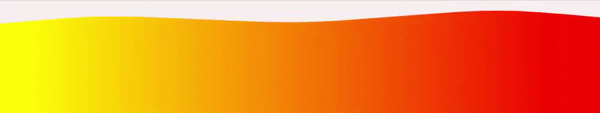

# Vue Wavify

[](https://www.npmjs.com/package/vue-wavify)
[](https://www.npmjs.com/package/vue-wavify)
[](https://github.com/SvenWesterlaken/vue-wavify/blob/main/LICENSE)

A single Vue component to create and adjust an animated wave using svg & javascript.

# Installation
**Yarn**

    yarn add vue-wavify

**npm**

    npm install vue-wavify


# Usage

The package can be imported globally or locally.

**Locally (single file component)**
```vue
<template>
  <div class="wave-container">
    <vue-wavify fill="#f79902"/>
  </div>
</template>

<script>
import VueWavify from 'vue-wavify';

export default {
  components: { VueWavify }
});
</script>
```

**Globally**
```js
import Vue from 'vue';
import VueWavify from 'vue-wavify';

Vue.use(VueWavify);
// Or
Vue.component('vue-wavify', VueWavify);

```

# Props

In order the configure the wave, the following props can be applied:

| prop        | default | type      | description |
| ----------- |:-------:|:---------:|:----------- |
| `paused`    | `false` | `Boolean` | Pauses the animation |
| `points`    | `3`     | `Number`  | Amount of points used to form the wave |
| `speed`     | `0.15`  | `Number`  | Speed that the wave animation plays at |
| `height`    | `20`    | `Number`  | Height of the wave relative to the SVG element |
| `amplitude` | `20`    | `Number`  | Amplitude of the rendered wave |
| `fill`      | `blue`  | `String`  | Color of the wave (can be anything that a SVG path accepts) |

**Note:** Props that are not mentiond above will be passed on to the path element (instead of the container). Except for `id` & `style` attribute, these will be added to the container.

# Configuring the SVG
It is possible to configure and style the svg more precisely by using the default [slot](https://vuejs.org/v2/guide/components-slots.html).
This can be any HTML a SVG accepts. For example a `<defs>` component to add gradients, clipping paths, or masks.

## Examples

Below are some examples on how to implement the slot for configuring the svg/path.

### Gradient
```vue
<template>
  <vue-wavify fill="url(#gradient)">
    <defs>
      <linearGradient id="gradient">
        <stop offset="0%" style="stop-color:rgb(255,255,0);" />
        <stop offset="100%" style="stop-color:rgb(255,0,0);" />
      </linearGradient>
    </defs>
  </vue-wavify>
</template>
```
#### Result:



### Clipping path (mask)
```vue
<template>
  <vue-wavify fill="#e62315" mask="url(#mask)" :points="20" :amplitude="25" :speed="0.2" :height="20">
      <defs>
        <mask id="mask">
          <path d="M10,35 A20,20,0,0,1,50,35 A20,20,0,0,1,90,35 Q90,65,50,95 Q10,65,10,35 Z" fill="white" />
        </mask>
      </defs>
    </vue-wavify>
</template>
```
#### Result:


### Gradient
```vue
<template>
  <vue-wavify mask="url(#mask2)" fill="#1277b0" >
    <defs>
      <linearGradient id="grad" gradientTransform="rotate(90)">
        <stop offset="0" style="stop-color:white;" />
        <stop offset="0.5" style="stop-color:black;" />
      </linearGradient>
      <mask id="mask2">
        <rect x="0" y="0" width="800" height="200" fill="url(#grad)"/>
      </mask>
    </defs>
  </vue-wavify>
</template>
```
#### Result:


# Styling the container
In order for the svg to take up full-width there is a container surrounding the svg with a class of `.vue-wavify-wave`. By standard its styling is set to `width: 100%; display: inline-block;`. The svg animating the wave is set to a width & height of 100%. Therefore, it is advised to manipulate the height and width by using the css class of the container.

# Credits

This component/package is mainly based on the [react-wavify](https://www.npmjs.com/package/react-wavify) package and can be seen as a simple port from react to vue, implementing functionalities similar to that of [Benjamin Grauwin](http://benjamin.grauwin.me/)'s [Wavify](https://github.com/peacepostman/wavify) plug-in.
